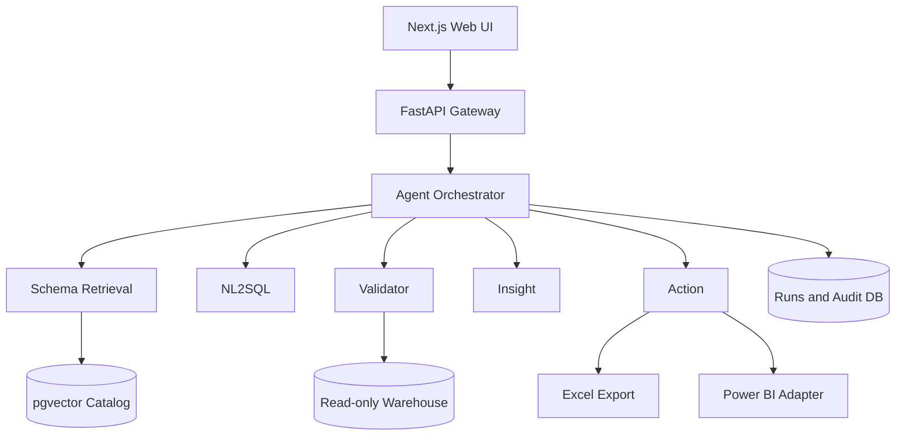

# Architecture Specification

## Logical architecture



## Runtime flow

1. API creates a `run_id` and records the normalized question.
2. Schema agent retrieves versioned catalog chunks filtered by
   tenant/source.
3. NL2SQL returns a structured draft containing SQL, referenced objects,
   assumptions and confidence.
4. Static validation parses the SQL AST and enforces the allowlist.
5. Query executes through a read-only transaction with timeout and row
   limit.
6. Result validation checks empty results, cardinality, nulls, configured
   ranges, totals and comparison-period completeness.
7. Failed validation produces structured feedback; the orchestrator permits
   up to two repairs.
8. Insight agent receives the validated result and returns claims linked to
   result cell IDs.
9. UI receives a final response and may request an action.
10. Action policy checks role, destination and approval before
    export/publish.

## Orchestration state

```
RECEIVED → RETRIEVING → GENERATING_SQL → STATIC_VALIDATION
  → EXECUTING → RESULT_VALIDATION → GENERATING_INSIGHT → READY

STATIC_VALIDATION / RESULT_VALIDATION → REPAIR_SQL (max 2) → GENERATING_SQL

Any state → NEEDS_CLARIFICATION | FAILED | CANCELLED

READY → ACTION_PENDING → ACTION_RUNNING → COMPLETED
```

This is implemented as an **explicit, typed state machine** in the API
process — never as an unconstrained conversation between agents.

## Key design decisions

- Use an explicit state machine instead of unconstrained agent conversation.
- Treat each "agent" as a bounded component with a JSON schema, tools and
  policy.
- Keep arithmetic in SQL/Python validation, not in the language model.
- Separate answer generation from external action.
- Store prompts by version and retain hashes rather than uncontrolled full
  sensitive context.
- Use a provider interface so tests can run with deterministic fixtures
  without paid API calls.

See [docs/adr/](adr/) for the detailed rationale behind these decisions.

## Data stores

| Store                 | Purpose                                                                    |
| ---------------------- | --------------------------------------------------------------------------- |
| Warehouse              | Marketplace operations tables/views (projects, tasks, departments, accounts), queried read-only |
| Catalog/pgvector        | Embedded schema, glossary, measures and relationships                       |
| Application DB          | Users, runs, messages, validations, actions and feedback                    |
| Object/file storage     | Optional exported workbooks; local volume in MVP                            |

In local development, the application DB and the warehouse run in the same
Postgres instance (see `docker-compose.yml`); `DATABASE_URL` and
`WAREHOUSE_URL` are configured independently so they can be split onto
separate instances/credentials at any time without an application code
change.

## Failure handling

- Retrieval below threshold: request clarification; do not guess.
- SQL parse/policy failure: repair without execution.
- Warehouse timeout: return a bounded error and optimization hint.
- Validation failure after retry limit: expose diagnostics to analyst; no
  narrative/action.
- Model outage: preserve run state and allow retry.
- Action failure: retain validated answer and an idempotency key for safe
  retry.
